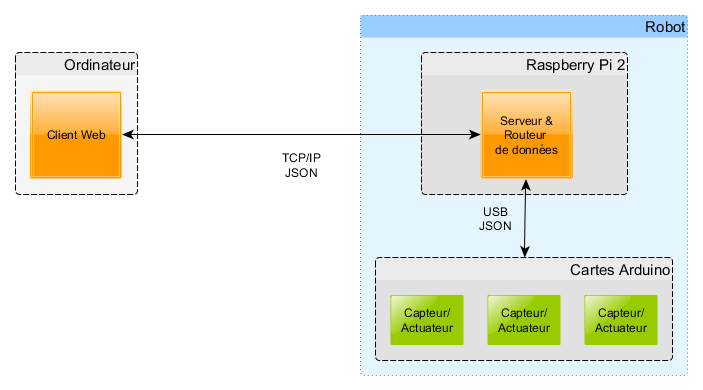

## Projet de serveur REST pour le robot Tardis

### Schéma de principe

### Client Web
#### Interface pour:
- Afficher les valeurs des capteurs (données brutes)
- Modifier les actuateurs

### Serveur Web (Raspberry Pi)
- Fournit une API REST pour dialoguer avec le client web
- Route les commande du client avec les cartes Arduino et les données entre les cartes Arduino

### Cartes Arduino
- Utilisation de l'USB pour dialoger avec le serveur
- Serialisation des données via JSON

## Principal matériel à disposition
- (Arduino) carte de contrôle pour déplacement omnidirectionnel
- (Arduino) detecteur d'obstacles par ultrason
- (Arduino) système de récupération d'objets cylindriques
- (Raspberry Pi 2) caméra
- (Routeur Wifi) Dialogue avec le raspberry pi via TCP/UDP

## API routes
Les routes suivantes nous permettent d'accèder à nos canaux en lecture (GET) ou écriture (POST).

### Get
| Routes                        | Descrition                                                                            |
|---                            |---                                                                                    |
| /channels                     | Retourne la liste des canaux avec la dernière valeur écrite dedans en format JSON     |
| /channels/channel_name        | Retourne la valeur correspondante au nom du canal                                     |

### Post
| Routes                        |Descrition                                     |
|---                            |---                                            |
| /channels/channel_name        | Indique sur quel canal on change la valeur    |

#### Contenu de la requète POST
Les données de la requète HTTP POST contiennent une valeur en JSON comme suit:
{"nom_canal": valeur}

## Liste des canaux
Canaux permettant de dialoguer avec les périphériques du robot. Toute les valeurs sont de type entière.

    {
        "avoid_direction" : [Vx, Vy]
    }

    {
        "mesured_pos" : [x, y, theta]
    }

    {
        "ultrasonic" : [u1, u2, u3, u4, u5, u6, u7, u8, u9, u10, u11]
    }

    {
        "new_pos" : [x, y, theta]
    }

# Configuration Raspberry Pi
Ceci est la configuration du Raspberry Pi utilisé pour le serveur du robot.

## Interface Réseau
Dans /etc/network/intefaces :

Pas de changement pour l'interface de loopback

    auto lo
    iface lo inet loopback

Configuration d'une adresse ip statique pour l'interface eth0

    iface eth0 inet static
    address 192.168.0.5
    netmask 255.255.255.0
    gateway 192.168.0.1
    dns-nameserver 8.8.8.8

## Récupération des sources du serveur REST
> mkdir ~/Prog
> cd ~/Prog
> git clone https://github.com/thierryme/tardis-rest

## Installation des dépendance python
> sudo apt-get install && sudo apt-get update

> sudo apt-get install python-pip

> sudo pip install -r ~/Prog/tardis-rest/requirements.txt

## Persistance des noms des ports série
Dans le but d'avoir le même nom de port série à chaque redémarrage du Raspberry Pi, une série de règles spéciales Udev est crée.

Branchez d'abord un Arduino sur un port USB.
Ensuite, récupérez les informations "KERNELS" ave la commande suivante :
> udevadm info -a -n /dev/ttyACM0 | grep KERNELS

Get the first line without a ':'. If for exemple you have "1-1.2.4"  then edit/create the following file accordingly:
Cherchez la première ligne sans ':'. Par exemple "**1-1.2.4**". Créer / Modifier le fichier '/etc/udev/rules.d/99-arduino.rules' de la manière suivante :
> sudo vim /etc/udev/rules.d/99-arduino.rules

    SUBSYSTEM=="tty", KERNEL=="ttyACM*", KERNELS=="**1-1.2.4**", SYMLINK+="ttyACM0001"

Pour plus de détails, voir :
- http://hintshop.ludvig.co.nz/show/persistent-names-usb-serial-devices/
- https://wiki.archlinux.org/index.php/arduino

## Dépendences Arduino
- ArduinoJson
- Mecanum4WD
- Sonicsense
- Spots
